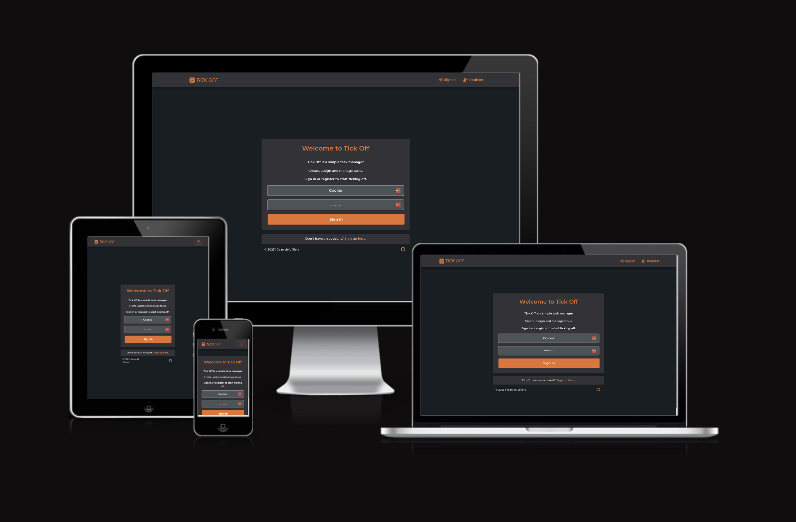

#Tick Off

[View website](https://tick-it-app-pp5.herokuapp.com/)

## Table of Contents

- [Table of Contents](#table-of-contents)
- [About Tick Off](#about-tick-off)
- [Project Goal](#project-goal)
- [User Experience](#user-experience)
  - [Target Audience](#target-audience)
  - [User Requirements](#user-requirements)
  - [User Stories](#user-stories)
    - [User Account/Profile](#user-accountprofile)
    - [Task Management](#task-management)
    - [Discussions](#discussions)
    - [Category Management](#category-management)
    - [Navigation](#navigation)
  - [Owner Stories](#owner-stories)
- [Technical Design](#technical-design)
  - [Agile Methodology](#agile-methodology)
  - [CRUD Functionality](#crud-functionality)
  - [Colours](#colours)
  - [Fonts](#fonts)
  - [Wireframes](#wireframes)
- [Technologies](#technologies)
  - [Programming Languages](#programming-languages)
  - [Frameworks \& Tools](#frameworks--tools)
  - [Libraries](#libraries)
- [Frontend](#frontend)
  - [React](#react)
- [Backend API](#backend-api)
  - [Django REST Framework](#django-rest-framework)
- [Features](#features)
  - [Registration](#registration)
  - [Authentication](#authentication)
  - [Sign In](#sign-in)
  - [Sign Out](#sign-out)
  - [Navigation Bar](#navigation-bar)
  - [Home Page](#home-page)
  - [Dashboard](#dashboard)
  - [Tasks List](#tasks-list)
  - [Task Search \& Filter](#task-search--filter)
  - [Add a Task](#add-a-task)
  - [Edit a Task](#edit-a-task)
  - [Delete a Task](#delete-a-task)
  - [Categories](#categories)
  - [Add a Category](#add-a-category)
  - [Edit a Category](#edit-a-category)
  - [Delete a Category](#delete-a-category)
  - [Task Comments](#task-comments)
  - [Create a Comment](#create-a-comment)
  - [Update a Comment](#update-a-comment)
  - [Delete a Comment](#delete-a-comment)
  - [Profile Page](#profile-page)
  - [Task Count](#task-count)
  - [Edit Profile](#edit-profile)
  - [Update Username](#update-username)
  - [Update Password](#update-password)
  - [User List](#user-list)
  - [Error Page](#error-page)
  - [User Action Feedback](#user-action-feedback)
  - [Future Improvements](#future-improvements)
- [Validation](#validation)
  - [HTML Validation](#html-validation)
  - [CSS Validation](#css-validation)
  - [ESLint Javascript Validation](#eslint-javascript-validation)
  - [Chrome Dev Tools Lighthouse Validation](#chrome-dev-tools-lighthouse-validation)
    - [Mobile](#mobile)
  - [WAVE Accessibility Validation](#wave-accessibility-validation)
- [Testing](#testing)
  - [Devices](#devices)
  - [Web Browsers](#web-browsers)
  - [Manual Tests](#manual-tests)
- [Bugs](#bugs)
  - [Users are unable to set task due date](#users-are-unable-to-set-task-due-date)
  - [Due date reverts to current date, regardless of the date selected in the date picker](#due-date-reverts-to-current-date-regardless-of-the-date-selected-in-the-date-picker)
  - [When task status is set to COMPLETED, the display reads "invalid date" until page is reloaded](#when-task-status-is-set-to-completed-the-display-reads-invalid-date-until-page-is-reloaded)
  - [Profile task count always displays 10, until result 11+ are loaded via InfiniteScroll component](#profile-task-count-always-displays-10-until-result-11-are-loaded-via-infinitescroll-component)
- [Deployment](#deployment)
  - [Heroku](#heroku)
  - [Cloning a GitHub Repository](#cloning-a-github-repository)
- [Credits](#credits)
  - [Images](#images)
  - [README](#readme)

## About Tick Off

Tick Off is a task manager for small a small team working on a single project

## Project Goal
The goal is to provide a productivity platform where users can collaborate on tasks. Users can create tasks and assign them to other users.

Key features:

- User registration
- User authentication
- User profile containing avatar, username, tasks they created and tasks assigned to them
- The app is easy to use and contains intuitive navigation across all pages
- CRUD functionality for tasks, categories, comments & user profiles
- Task filtering by keyword search, category, status & priority

## User Experience
-

### Target Audience
-

### User Requirements
-

### User Stories

#### User Account/Profile

1. As a new user I can register an account so that I can take part in managing and completing tasks
2. As a user I can log into my account so that I can view & manage tasks and update my profile
3. As a user I can update my username so that I can change it if I need to
4. As a user I can reset my password so that I can always access my account
5. As a user I can edit my profile so that my information is up to date
6. As a user I can view a home page so that I can read instructions on how to use the Tick Off

#### Task Management

1. As a user I can access my own dashboard so that I can get an overview of tasks I created and tasks assigned to me
2. As a user I can create tasks so that I can track and manage my activities
3. As a user I can view a list of tasks so that I can see details of tasks I own and tasks assigned to me
4. As a user I can search and filter a task list so that I can quickly find what I'm looking for
5. As a user I can edit tasks I own so that task details can be correct and up to date
6. As an assigned user I can update a task's status so that the task progress is clear
7. As a user I can delete tasks i own so that I can remove any duplicates, or tasks created in error
8. As a user I can add attachments to tasks so that I can clearly demonstrate a point an avoid describing it insufficiently
9. As an assigned user I can update a task's status so that the task progress is clear

#### Discussions

1. As a role I can create comments so that I can take part in discussions around a task
2. As a user I can view comments so that I can stay up to date with task discussions
3. As a user I can update my own comments so that I can keep information relevant and up to date
4. As a user I can delete my own comments so that I can correct any mistakes

#### Category Management

1. As a user I can create categories so that keep tasks organised
2. As a user I can view a list of categories so that I know if a certain category already exists
3. As a user I can update categories so that they are always relevant and up to date
4. As a user I can delete categories so that unnecessary clutter can be avoided

#### Navigation

1. As a user I can access a navbar on every page so that I can easily navigate between pages
2. As a user I can see a 404 - Not Found page with a redirect button so that I can easily navigate back to a working page

### Owner Stories
-

## Technical Design

### Agile Methodology
-

### CRUD Functionality
-

### Colours
-

### Fonts
-

### Wireframes
-

## Technologies
### Programming Languages
-

### Frameworks & Tools
-

### Libraries
-

## Frontend

### React
-

## Backend API
### Django REST Framework
-

## Features
hgfd

### Registration
-

### Authentication
-

### Sign In
-

### Sign Out
-

### Navigation Bar
-

### Home Page
-

### Dashboard
-

### Tasks List
-

### Task Search & Filter
-

### Add a Task
-

### Edit a Task
-

### Delete a Task
-

### Categories
-

### Add a Category
-

### Edit a Category
-

### Delete a Category
-

### Task Comments
-

### Create a Comment
-

### Update a Comment
-

### Delete a Comment
-

### Profile Page
-

### Task Count
-

### Edit Profile
-

### Update Username
-

### Update Password
-

### User List
-

### Error Page
-

### User Action Feedback
-

### Future Improvements
-

## Validation
### HTML Validation
-

### CSS Validation
-

### ESLint Javascript Validation
-

### Chrome Dev Tools Lighthouse Validation
-

#### Mobile
-

### WAVE Accessibility Validation
-

## Testing

### Devices
-

### Web Browsers
-

### Manual Tests
-

## Bugs

### Users are unable to set task due date ###
**Fix:**   
Add Due Date field, which was missing from API

### Due date reverts to current date, regardless of the date selected in the date picker ###
**Fix:**  
Set `auto_now=False` in Task model

### When task status is set to COMPLETED, the display reads "invalid date" until page is reloaded ###
**Fix:**  
Added
`completed_date: newStatus === "Completed" ? new Date() : null,` to the `submitForm` function.

This change ensures that `completed_date` is properly formatted and prevents the "Invalid Date" message.

### Profile task count always displays 10, until result 11+ are loaded via InfiniteScroll component ###
**Fix:**  
Replace `const profileTaskCount = profileTasks.results.length;` with `const profileTaskCount = profileTasks.count;`  
and `const assignedTaskCount = assignedTasks.results.length;` with `const assignedTaskCount = assignedTasks.count;`  

## Deployment

### Heroku
-

### Cloning a GitHub Repository

Clone the repository as follows: 

1. Navigate to [GitHub]https://github.com/ and log in
2. Navigate to the relevant [Repository](https://github.com/PhantomPWR/pp5-productivity-tool-frontend/)
3. Find green button labelled "Code" at the top right, above "commits""
4. Select the preferred clone method and click the copy button
5. Open Git Bash
6. Change the working directory to the directory where you'd like to create the clone
7. Enter `git clone` and paste the URL copied in Step 4 above
8. Enter `$ clone https://github.com/PhantomPWR/pp5-productivity-tool-frontend.git`
9. Press enter and the local clone will be created

## Credits

### Images
-

### README
-

